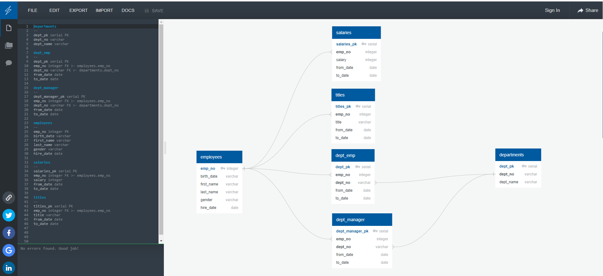

# postgres-sql-employee

Author:  Erin James Wills, ejw.data@gmail.com  

<cite>Photo by [Tobias Fischer](https://unsplash.com/@tofi?utm_source=unsplash&utm_medium=referral&utm_content=creditCopyText) on [Unsplash](https://unsplash.com/s/photos/database?utm_source=unsplash&utm_medium=referral&utm_content=creditCopyText)</cite> 

 

## Overview

  

The purpose of this repo is to create a database of employee information.  The records in the database are fictitious so no personal information is being exposed.  The database is made up of 6 tables with primary keys and some foreign keys.  The structure of the database is display below but the key tables include an employee information table, a salary table, a department managers, and a department employees table.  Essentially, information about each employee is accessible including if the person works in one or more departments, if they are a manager, and what their base salary is.    

Within this repo is a schema sql file for generating the table structure.  In addition, for each table there is a csv file of data. The accompanying Jupyter Notebook includes SQLAlchemy code for performing queries on the database and showing how that data can be used in dataframes and matplotlib charts.  A separate set of queries can also be found in a SQL script that can be run directly from pgAdmin.   Note:  The QuickDatabaseDiagrams website was used to generate the table structure.  The script for that web-based toolis also located in the repo.    

 

## Technologies  
*  Python
*  PostgreSQL/SQL
*  SQLAlchemy
*  [QuickDatabaseDiagrams](https://www.quickdatabasediagrams.com/)

 

## Data Source  
Dataset generated by Trilogy Education Services. Origins beyond this is unknown. 

 

## Setup and Installation  
1. Setup Postgres Database
    *  Create database in pgAdmin called `employee_db`
    *  Open a Query Tool and paste/open the contents of `database_setup/schema_query.sql`
    *  Run this entire script.  
    *  Next load the data into the database.  
        *  First, right click on schema and select Import/Export Data
        *  Select Import button
        *  Select the file location `data/titles.csv`
        *  Select the 'has headers' button
        *  Select the delimiter to be a 'comma' 
        *  Select Okay.  The data should import quickly.  
    *  Repeat the process above for the following files in this specific order:
        *  `departments.csv`
        *  `employees.csv`
        *  `salaries.csv`
        *  `dept_emp.csv`
        *  `dept_manager.csv`
    *  Test that the database loaded correctly by making a couple queries:  
        *  `Select * from salaries;`
        *  etc....
    *  Next, test out specific queries found in the `database_setup/query_database.sql`
1.  Next Setup your Environment with:  
    *  Python 3.6+  
    *  pandas  
    *  numpy
    *  sqlalchemy
    *  psycopg2
1. Activate your environment
1. Clone the repo to your local machine
1. Start Jupyter Notebook within the environment from the repo folder
1. Run `analysis/data_analysis.ipynb` 

 

## Analysis  
*  For example SQL queries, run `database_setup/query_database.sql`.
*  For example ORM SQLAlchemy queries and pandas plots, run `data_analysis.ipynb`  
*  Demonstrated in the notebook is one method of using SQLAlchemy.  I prefer the ORM method over the SQLAlchemy Table method.  
*  Checkout my repo called `sqlalchemy-flask-api-weather` for my preferred style.  

 

<figure>

<figcaption>Fig.1 - Screenshot of QuickDatabaseDiagrams.com Schema Creater</figcaption>
</figure>
 

## Sample Queries from pgAdmin 

1. List the following details of each employee: employee number, last name, first name, gender, and salary.  
   >Select employees.emp_no, employees.last_name, employees.first_name, employees.gender, salaries.salary  
From employees, salaries
Where employees.emp_no = salaries.emp_no

2. List employees who were hired in 1986.  
   >Select employees.emp_no, employees.last_name, employees.first_name, employees.hire_date
From employees
Where Extract(Year FROM hire_date) = 1986

3. List the manager of each department with the following information: department number, department name, 
-- the manager's employee number, last name, first name, and start and end employment dates.  
   >Select departments.dept_no, departments.dept_name, dept_manager.emp_no, employees.last_name, employees.first_name, dept_manager.from_date, dept_manager.to_date  
   >From departments  
    INNER Join dept_manager On departments.dept_no = dept_manager.dept_no  
    Inner Join employees On employees.emp_no = dept_manager.emp_no  

4. List the department of each employee with the following information: employee number, last name, 
-- first name, and department name.   
   >Select employees.emp_no, employees.last_name, employees.first_name, departments.dept_name  
From employees  
Inner Join dept_emp on dept_emp.emp_no = employees.emp_no  
Inner Join departments on dept_emp.dept_no = departments.dept_no  

5. List all employees whose first name is "Hercules" and last names begin with "B."  
   >Select employees.first_name, employees.last_name
From employees   
Where employees.first_name = 'Hercules' AND   
LEFT(employees.last_name, 1) = 'B'  

6. List all employees in the Sales department, including their employee number, last name, first name, and department name.
   >Select employees.emp_no, employees.last_name, employees.first_name, departments.dept_name  
From employees  
Inner Join dept_emp on dept_emp.emp_no = employees.emp_no   
Inner Join departments on dept_emp.dept_no = departments.dept_no   
Where dept_emp.dept_no = 'd007'   

7. List all employees in the Sales and Development departments, including their employee number, last name, first name, and department name.   
   >Select employees.emp_no, employees.last_name, employees.first_name, departments.dept_name
From employees  
Inner Join dept_emp on dept_emp.emp_no = employees.emp_no  
Inner Join departments on dept_emp.dept_no = departments.dept_no  
Where dept_emp.dept_no = 'd007' OR dept_emp.dept_no = 'd005'  

8. In descending order, list the frequency count of employee last names, i.e., how many employees share each last name.
   >Select employees.last_name, count(employees.last_name)  
From employees  
Group By employees.last_name  
Order By count(employees.last_name) DESC  